# Endpoint

## Golang Go Gin

## Berikut adalah listnya

### 1️ Fungsi untuk input text palindrome atau bukan

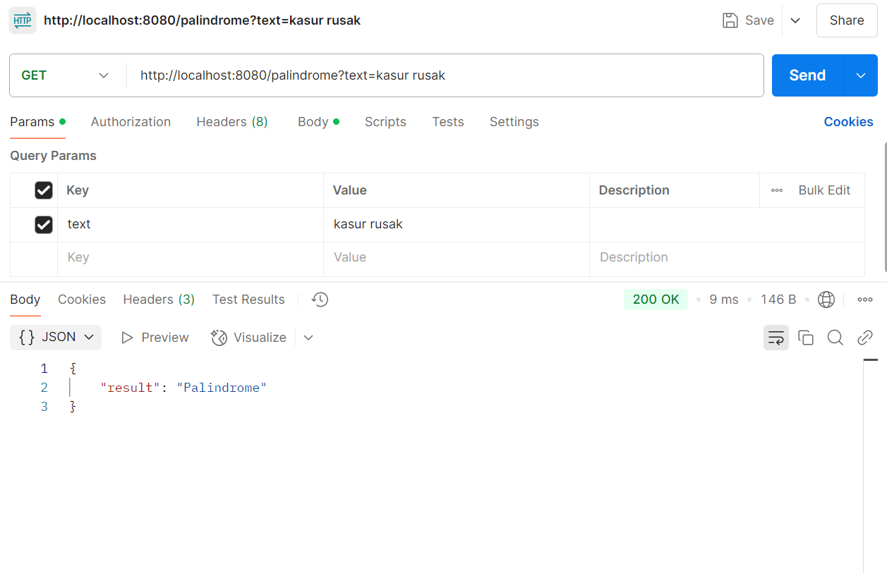

### 2️ Struct / Models dalam Golang

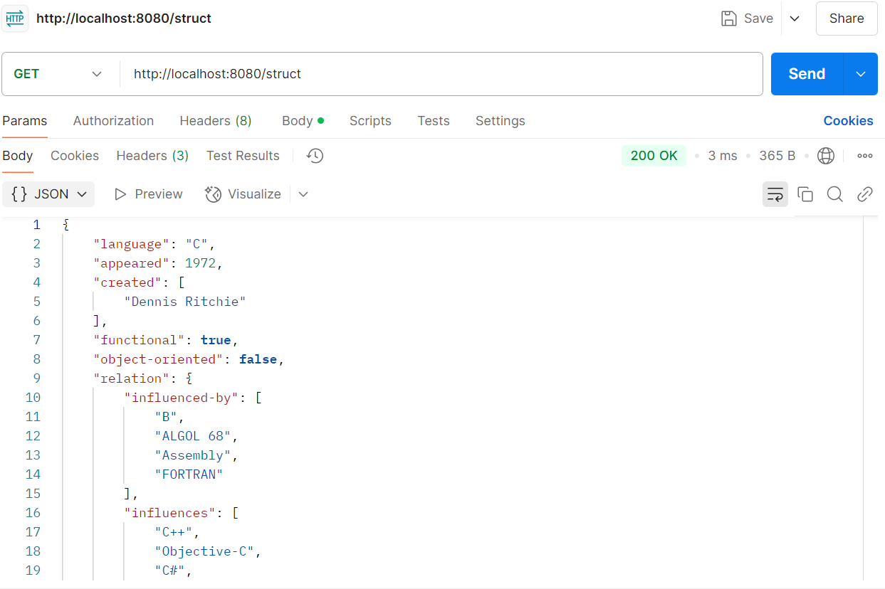

### 3️ REST API Server

#### 3.1 Home Endpoint

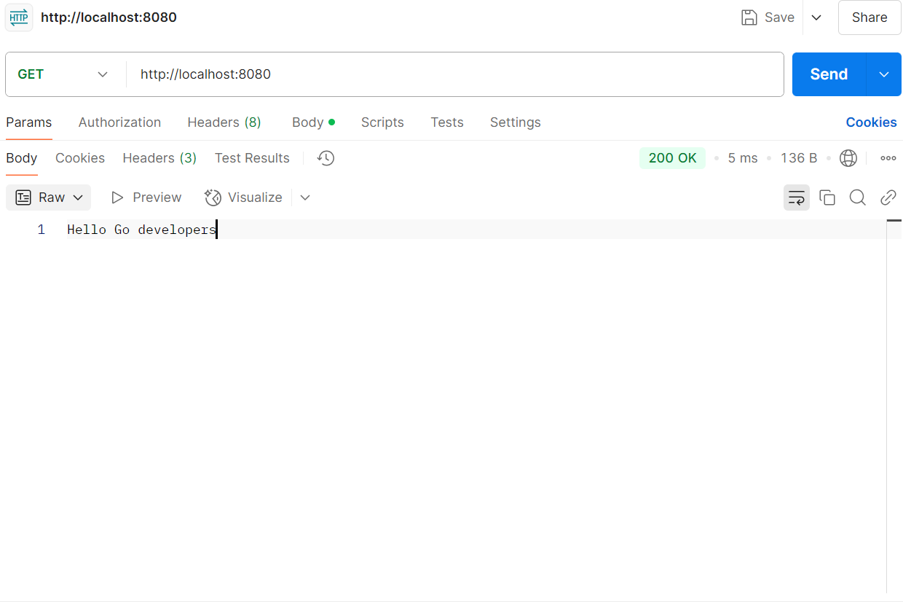

#### 3.2 Get Language by ID

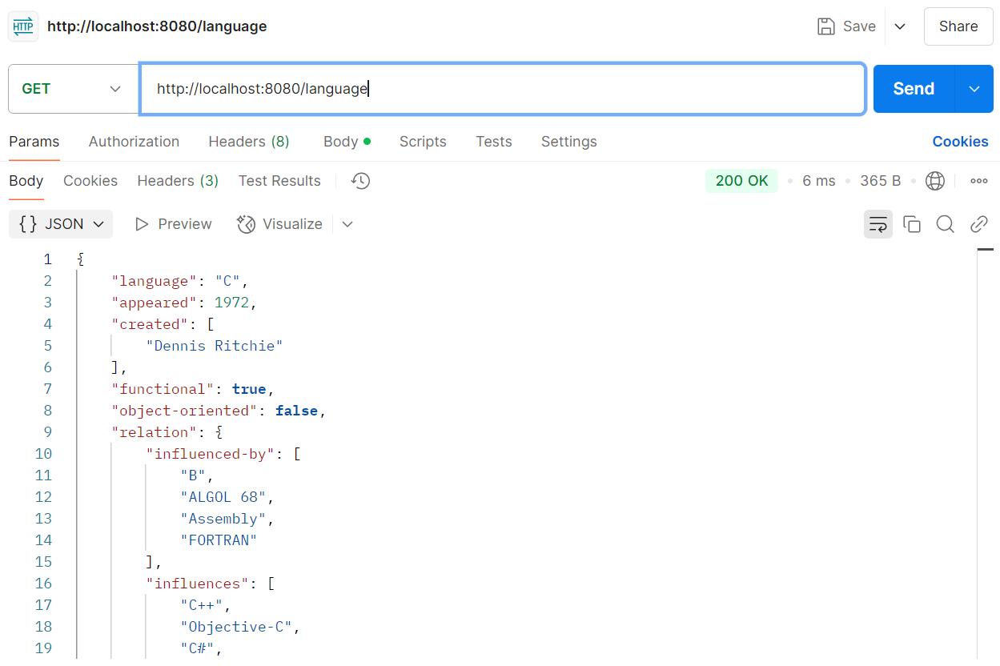

#### 3.3 Get All Languages

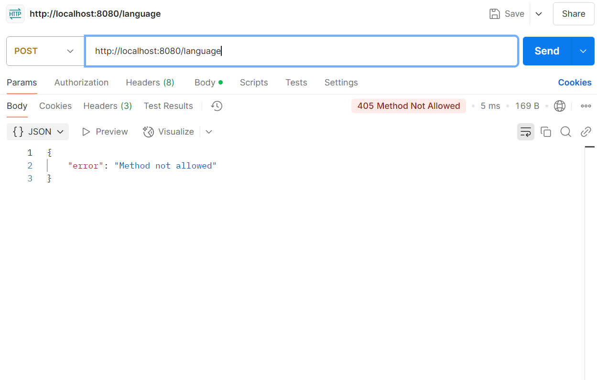

### 4️ Palindrome Check Endpoint

#### 4.1 Palindrome Success

#### 4.2 Palindrome Failure

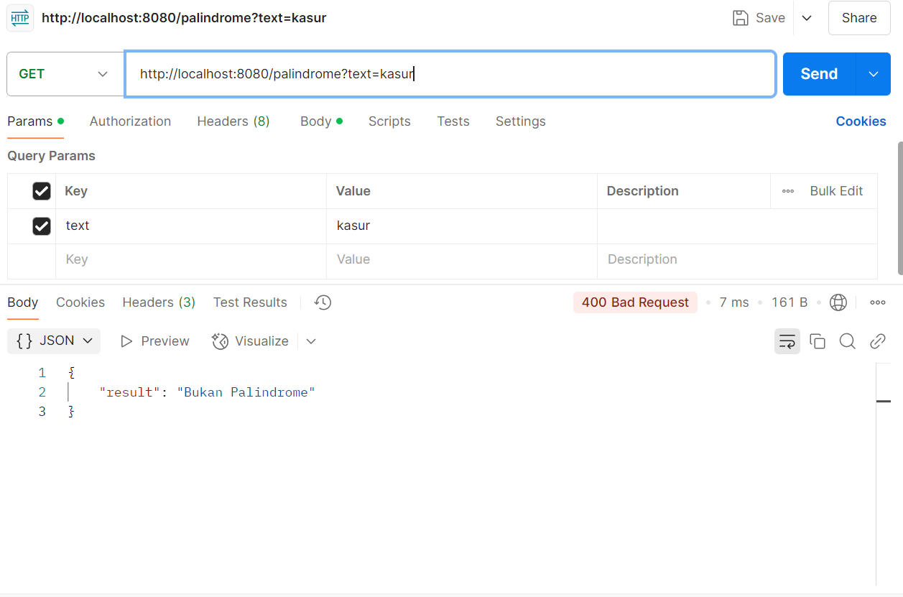

### 5️ CRUD Language Endpoint

#### 5.1 Create Language

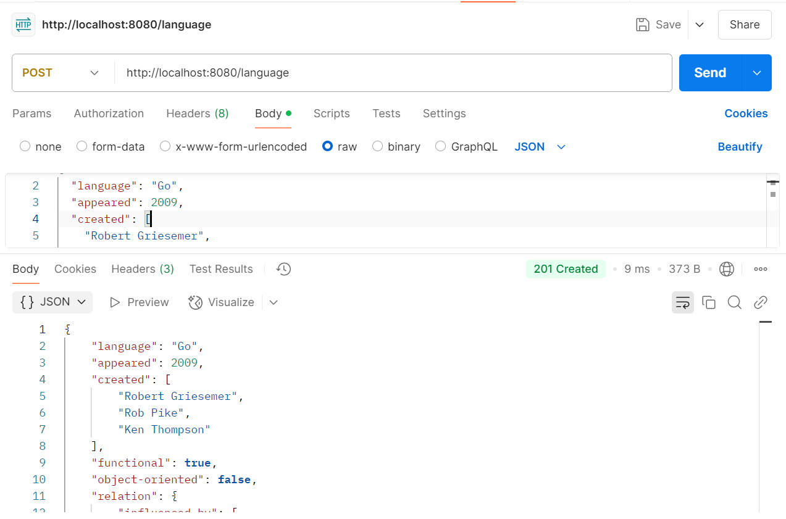

#### 5.2 Get Language by ID

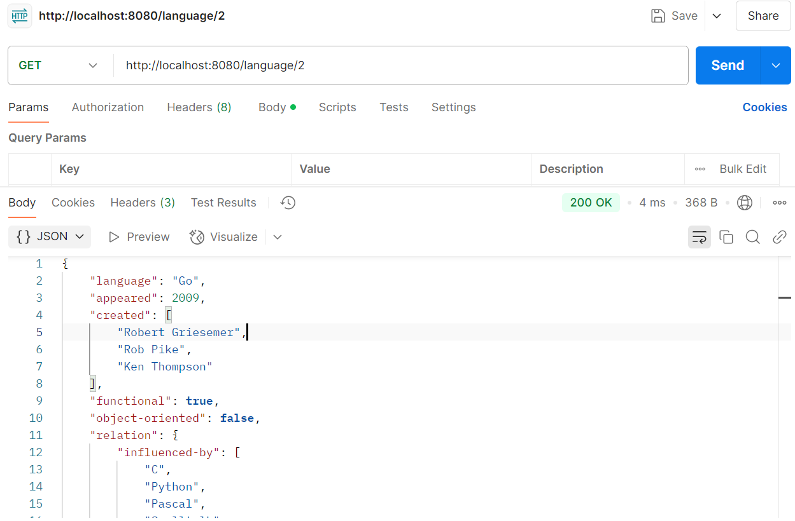

#### 5.3 Get All Languages

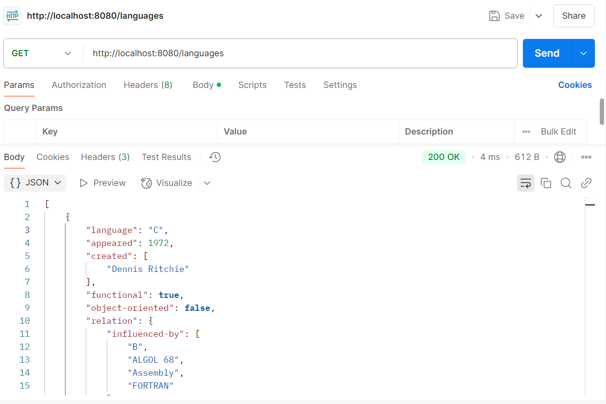

#### 5.4 Update Language

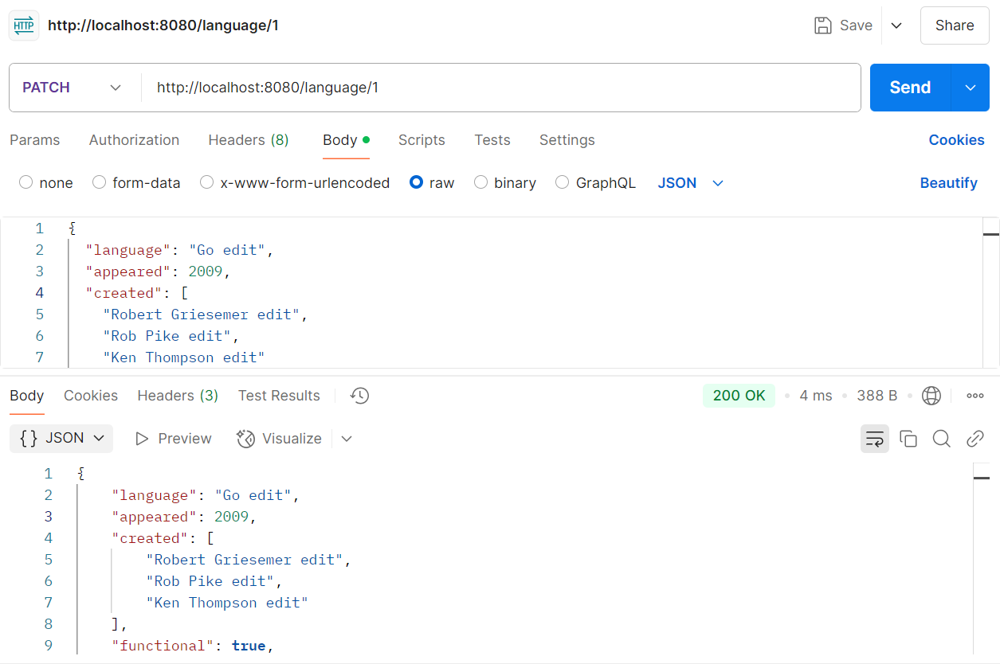

#### 5.5 Delete Language

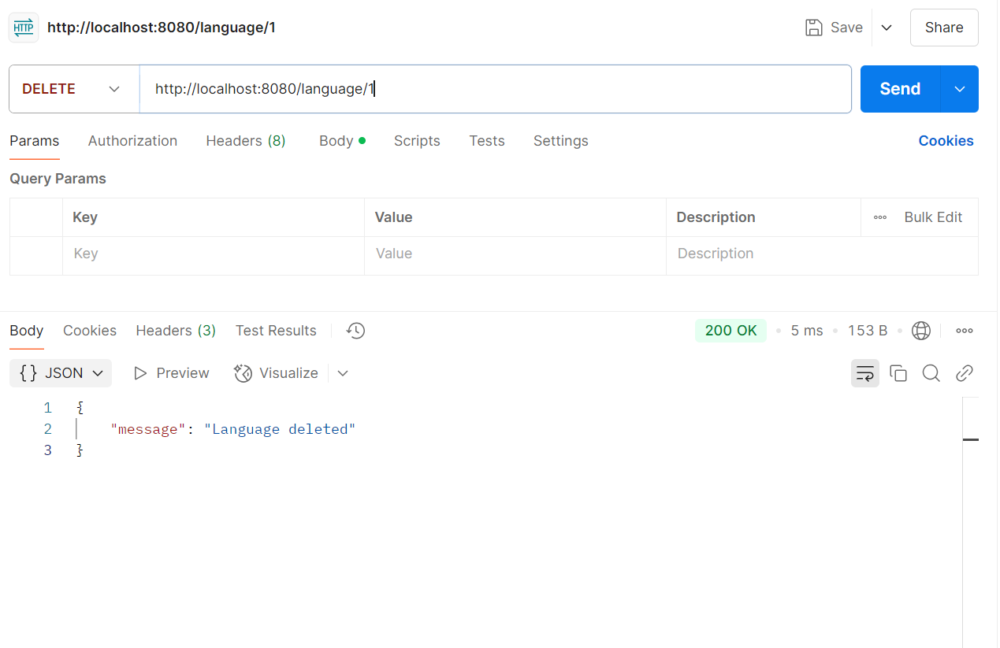
